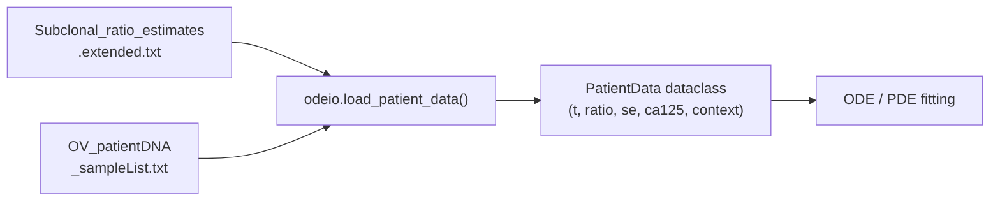

<!-- SPDX-FileCopyrightText: 2025 Abhinav Mishra -->
<!-- SPDX-License-Identifier: MIT -->

# Data

This document describes the data directory structure, file formats, and how to
prepare equivalent data for a different cohort.

## Overview

```
data/
├── ReadMe.txt                               # Brief dataset description
├── OV_patientDNA_sampleList.txt             # QC metadata table
├── CNA_tables/                              # QDNAseq copy-number archives
│   ├── Copynumber_tables_UP0018.combined.500.RData
│   ├── Copynumber_tables_UP0042.combined.500.RData
│   ├── Copynumber_tables_UP0053.combined.500.RData
│   ├── Copynumber_tables_UP0055.combined.500.RData
│   └── Copynumber_tables_UP0056.combined.500.RData
├── liquidCNA_results/                       # liquidCNA algorithm outputs
│   ├── Estimates_OV_UP0018.vR.filtered.500.RData
│   ├── Estimates_OV_UP0042.vR.filtered.500.RData
│   ├── Estimates_OV_UP0053.vR.filtered.500.RData
│   ├── Estimates_OV_UP0055.vR.filtered.500.RData
│   ├── Estimates_OV_UP0056.vR.filtered.500.RData
│   ├── Subclonal_ratio_estimates.extended.txt   ← main pipeline input
│   └── Drivers_subclonalCNA.txt
└── patient_data/                            # Extracted CSVs (generated)
    ├── UP0018/  (9 CSV files)
    ├── UP0042/  (9 CSV files)
    ├── UP0053/  (9 CSV files)
    ├── UP0055/  (9 CSV files)
    └── UP0056/  (9 CSV files)
```

---

## Cohort

Five ovarian cancer patients: **UP0018, UP0042, UP0053, UP0055, UP0056**.

Data source: Hockings et al. (2025) *Cancer Research*,
DOI [10.1158/0008-5472.CAN-25-0351](https://doi.org/10.1158/0008-5472.CAN-25-0351).

Mendeley dataset: [10.17632/m93sk9n767.1](https://doi.org/10.17632/m93sk9n767.1)

---

## Raw inputs

### OV_patientDNA_sampleList.txt

Tab-separated QC metadata for all sequenced samples.

| Column | Description |
|--------|-------------|
| `SampleName` | Unique sample identifier (e.g. `UP0018_CTRL`) |
| `SampleType` | `WBC` (germline control) or plasma/tumour type |
| `Patient` | Patient ID (e.g. `UP0018`) |
| `Context` | Clinical context (e.g. `Normal control`, `1st relapse (cfDNA)`) |
| `DetectedCNA` | Whether a subclonal CNA was detected (`TRUE`/`FALSE`) |
| `DetectedInPatient` | Whether CNA was detected in at least one sample for this patient |
| `Qubit` | DNA concentration (ng/µL); `NA` if not measured |
| `Failed` | Whether sample failed QC (`TRUE`/`FALSE`) |
| `PanelSequenced` | Whether sample was also sequenced with a targeted panel |
| `Date` | Sample date (if available) |
| `Time` | Days from diagnosis to sample collection |
| `CA125_updated` | Revised CA125 value if a measurement error was corrected; `NA` otherwise |

### CNA_tables/

Each `.RData` file contains three R `data.frame` objects produced by
[QDNAseq](https://bioconductor.org/packages/QDNAseq/):

| Object | Description |
|--------|-------------|
| `bins.df` | Genomic bin definitions (chromosome, start, end, GC content, mappability) |
| `cn.df` | Per-bin copy-number values normalised to diploid baseline (1 = diploid) |
| `seg.df` | CBS-segmented copy-number calls per genomic segment |

These are intermediate products used by liquidCNA.  The `tumorfits` pipeline
does not consume them directly, but they are included for reproducibility and
can be extracted to CSV via `tumorfits extract-data`.

### liquidCNA_results/

#### Estimates_OV_UP00XX.vR.filtered.500.RData

Per-patient output of the liquidCNA subclonal ratio estimation algorithm.
Each `.RData` contains:

| Object | Description |
|--------|-------------|
| `pHat.df` | Estimated purity values per sample |
| `seg.df.corr` | Purity-corrected segmented copy-number values |
| `seg.av.corr` | Per-segment averages of purity-corrected CN (post-filtering of short segments) |
| `seg.plot` | Purity-corrected delta-CN values with chromosomal coordinates and clonal/subclonal annotation |
| `fitInfo` | Internal fitting diagnostics from the liquidCNA subclonal-ordering step |
| `final.medians` | Final subclonal ratio estimates (one row per sample) |
| `cutOff` | Estimated threshold for clonal vs subclonal calls |

#### Subclonal_ratio_estimates.extended.txt

**This is the primary input to the `tumorfits` pipeline.**

Tab-separated; one row per sample, multiple rows per patient.

| Column | Description |
|--------|-------------|
| `time` | Sample identifier (maps to `SampleName` in the sample list) |
| `context` | Clinical context string (e.g. `Diagnosis (Tumour)`, `1st relapse (cfDNA)`) |
| `Patient` | Patient ID |
| `relratio` | Relative ratio (0 = baseline/diagnosis, 1 = relapse reference) |
| `ratio` | Estimated subclonal CNA fraction (0–1); this is the primary modelled quantity |
| `ratio_min95` | Lower bound of 95% confidence interval for ratio |
| `ratio_max95` | Upper bound of 95% confidence interval for ratio |
| `Accept_estimate` | Quality flag: `yes`, `maybe`, or `no` |
| `CA125` | CA125 serum measurement (U/mL) at this time point |
| `Slope_before` | CA125 slope before this sample (derived quantity) |
| `Slope_after` | CA125 slope after this sample |
| `MinCA125` | Minimum CA125 across the patient's trajectory |
| `MaxCA125` | Maximum CA125 across the patient's trajectory |
| `Time` | Days from diagnosis |
| `DiagCA125` | CA125 at diagnosis |
| `MaxTime` | Maximum follow-up time (days) |

The `ratio` column is the observed resistant fraction used in the likelihood.
Rows with `Accept_estimate = no` are excluded by default.

#### Drivers_subclonalCNA.txt

Tab-separated table listing known driver genes located within subclonal CNA
segments identified by liquidCNA.

| Column | Description |
|--------|-------------|
| `GeneID` | Ensembl gene identifier |
| `Start`, `End` | Genomic coordinates |
| `Chrom` | Chromosome |
| `GeneName` | HGNC gene name |
| `Patient` | Patient ID |

---

## Processed data: data/patient_data/

The `data/patient_data/` directory is generated by `tumorfits extract-data`.
Each patient sub-directory contains nine CSV files extracted from the `.RData`
archives:

| File | Source object | Content |
|------|--------------|---------|
| `bins.df.csv` | `CNA_tables` | Genomic bin definitions |
| `cn.df.csv` | `CNA_tables` | Per-bin copy numbers |
| `seg.df.csv` | `CNA_tables` | Segmented copy numbers |
| `pHat.df.csv` | `liquidCNA_results` | Purity estimates |
| `seg.df.corr.csv` | `liquidCNA_results` | Purity-corrected segments |
| `seg.av.corr.csv` | `liquidCNA_results` | Averaged segment values |
| `seg.plot.csv` | `liquidCNA_results` | Plot-ready delta-CN table |
| `final.medians.csv` | `liquidCNA_results` | Subclonal ratio final estimates |
| `cutOff.csv` | `liquidCNA_results` | Clonality threshold |

!!! note "Index column"
    All CSVs are written with `index=True`, so the first column is the R
    row-name (usually a genomic location or sample identifier).

---

## Data flow within tumorfits



The `load_patient_data()` function in `tumorfits.odeio`:
1. Loads `Subclonal_ratio_estimates.extended.txt`
2. Filters rows by `Accept_estimate` flag
3. Optionally merges with `OV_patientDNA_sampleList.txt` for QC columns
4. Applies optional QC filters (drop failed, require panel-sequenced, etc.)
5. Rescales time (days → months if `time_unit="months"`)
6. Returns a `PatientData` dataclass

---

## Adapting for a different dataset

### Another patient cohort

1. Produce an equivalent `Subclonal_ratio_estimates.extended.txt` with the
   same column schema.  The minimum required columns are:
   - `Patient`, `Time` (days), `ratio`, `ratio_min95`, `ratio_max95`,
     `Accept_estimate`, `CA125`, `context`

2. Update `config.yaml`:
   ```yaml
   data:
     subclonal_ratios: "path/to/your_estimates.txt"
     sample_list: null   # or path to equivalent QC table
   cohort:
     flags: "yes"
   ```

3. Run the pipeline:
   ```bash
   snakemake --cores all --configfile config.yaml
   ```

### Another cancer type

The models are generic population-dynamics ODE/PDE systems.  The only
cancer-specific assumptions are:
- CA125 as a tumour-burden proxy — replace with a relevant serum biomarker
- The liquidCNA-derived subclonal fraction as the resistance proxy — replace
  with any longitudinal measure of resistant subclone prevalence
- Chemotherapy treatment contexts — update `context` values in your input table

Adjust the observation model parameters (`gamma`, `ca0`, `sigma_ca`) in
`config.yaml` or via CLI flags if your biomarker has different scaling.
