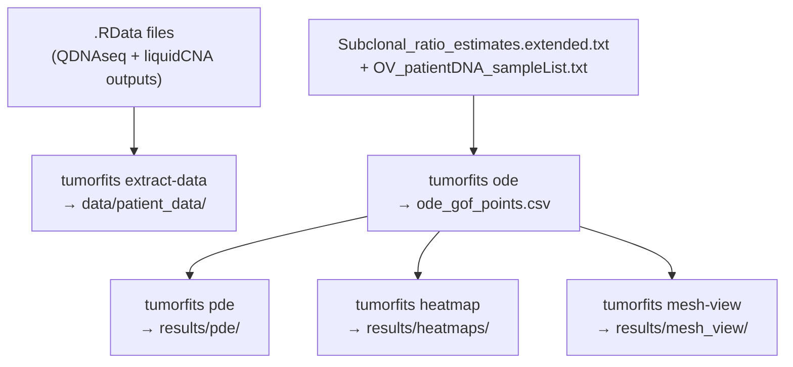

<!-- SPDX-FileCopyrightText: 2025 Abhinav Mishra -->
<!-- SPDX-License-Identifier: MIT -->

# Workflow

## Overview

The full pipeline proceeds in five stages.  All stages are driven by
`config.yaml` and orchestrated by Snakemake.



## Stage 1: Data extraction

**Rule:** `extract_data`

Reads every `.RData` file under `data/` and writes each `data.frame` R object
as a CSV to `data/patient_data/<patient_id>/`.

Input format: binary R `.RData` archives produced by QDNAseq and liquidCNA.

Output: structured CSV files used for diagnosis, QC, and manual inspection.

!!! note
    This step is only required if the `data/patient_data/` directory is missing.
    The repository ships with pre-extracted CSVs so this step can be skipped for
    the bundled dataset.

## Stage 2: ODE model fitting

**Rule:** `ode_fit`

Fits the well-mixed ODE model to each patient's longitudinal subclonal
fraction and CA125 data using multi-start L-BFGS-B optimisation.

Key outputs:
- `ode_gof_points.csv` — long-table CSV, one row per parameter per patient
- Per-patient state-trajectory plots in `results/ode_diag/`

See [Mathematical Model](model.md) for the equations.

## Stage 3: PDE model

**Rule:** `pde_run`

Runs the 1-D reaction–diffusion PDE using ODE parameter estimates as
initialisation.  Optionally re-fits the diffusion coefficients (DS, DR).

Output: per-patient fit plots and parameter CSVs in `results/pde/`.

## Stage 4: Heatmaps

**Rule:** `heatmaps`

Generates space-time heatmaps of S(x, t) and R(x, t) from the PDE
simulation without re-fitting.  One PNG per patient.

## Stage 5: Mesh visualisation

**Rule:** `mesh_view`

Runs a 2-D FEniCS reaction–diffusion simulation and produces three
PyVista off-screen PNG visualisations per patient:

| File | Content |
|------|---------|
| `<pid>_resistance_zones.png` | Spatial map of resistant cell fraction |
| `<pid>_streamlines.png` | Cell-density gradient streamlines |
| `<pid>_drug_efficacy.png` | Drug kill-rate overlay |

## Running with Snakemake

```bash
# Full pipeline
snakemake --cores all --configfile config.yaml

# Dry-run
snakemake -n --configfile config.yaml

# Single rule
snakemake --cores all results/ode_gof_points.csv

# Clean
snakemake clean --cores 1
```

## config.yaml structure

```yaml
data:
  root: "data"
  subclonal_ratios: "data/liquidCNA_results/..."
  sample_list: "data/OV_patientDNA_sampleList.txt"
  patient_data_dir: "data/patient_data"

cohort:
  flags: "yes,maybe"
  time_unit: "months"
  use_ca125_updated: true
  drop_failed: true

ode:
  out_points: "results/ode_gof_points.csv"
  n_starts: 8
  ...

pde:
  out_dir: "results/pde"
  n_cells: 200
  ...
```

All parameters are documented inline in `config.yaml`.
